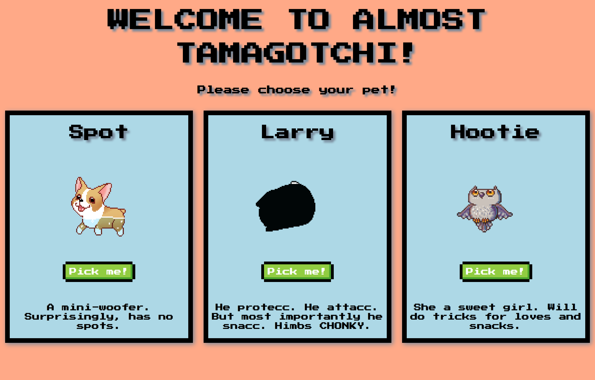
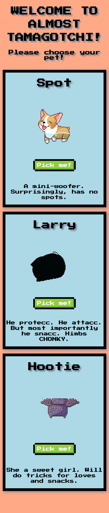
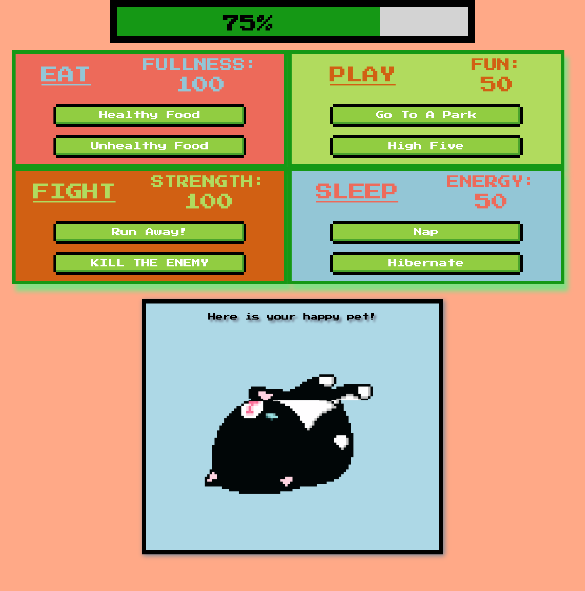
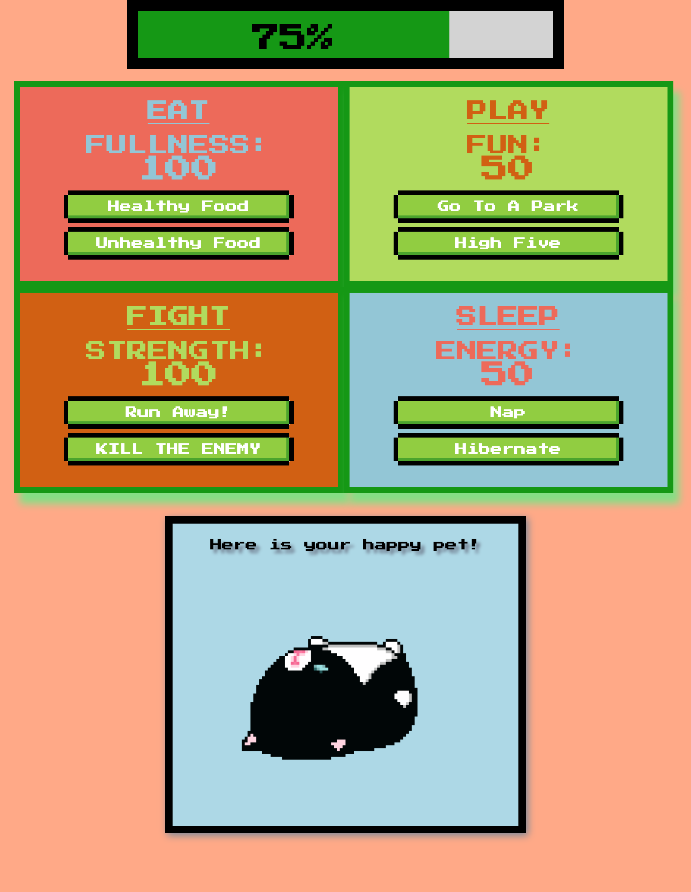
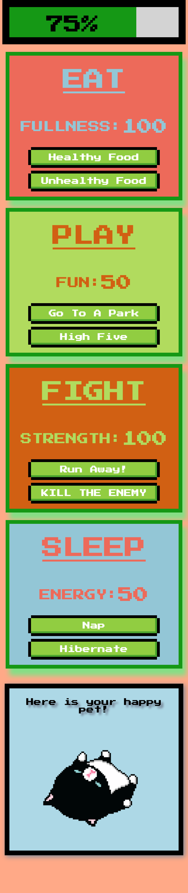
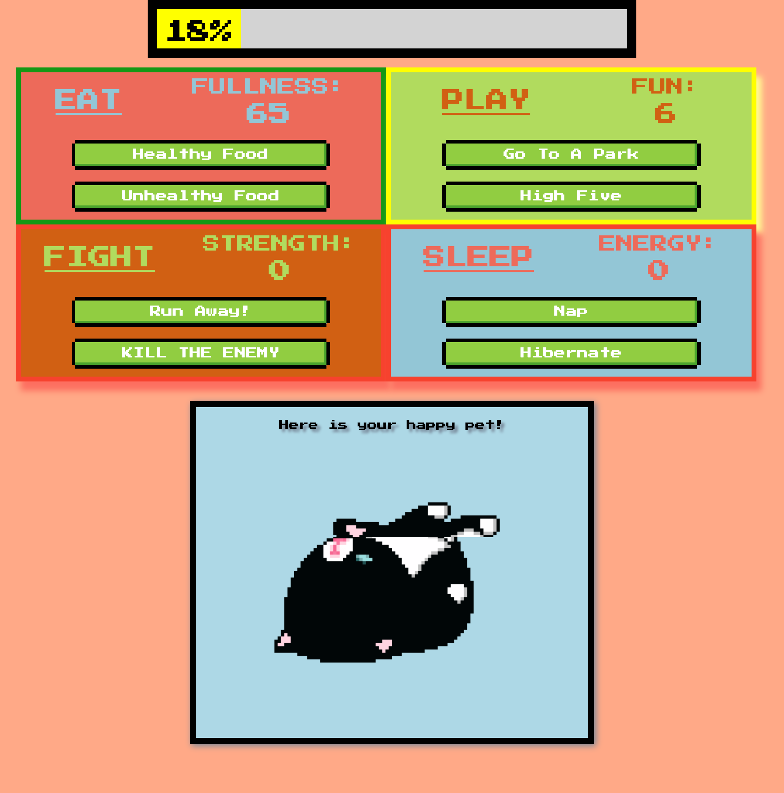
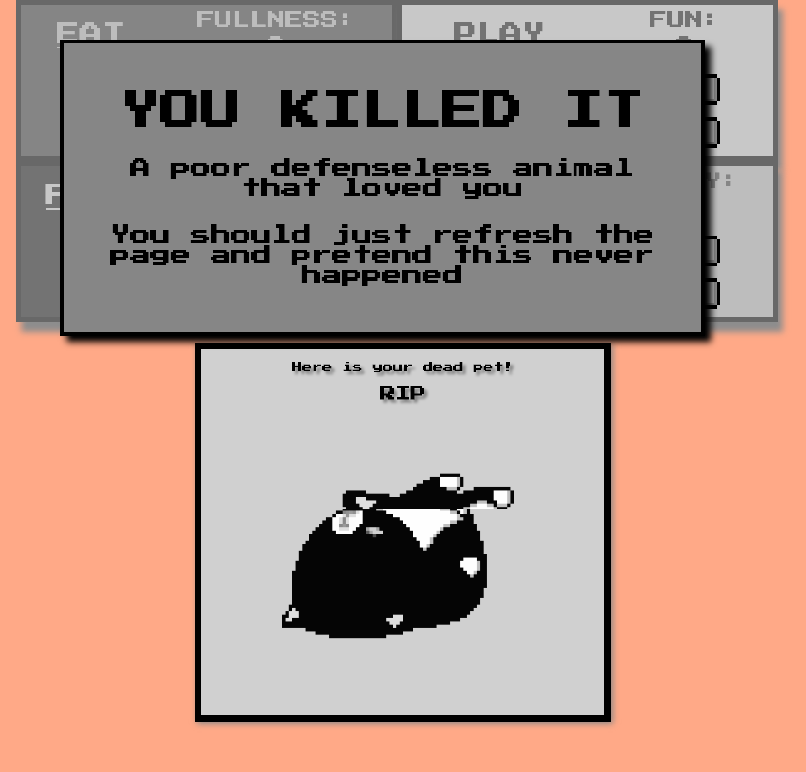

# Almost Tamagotchi

## Description
A website version of a tamagotchi game. You pick one of three pets and then you have 8 options of what to do with them. There are four sub-scores that total the main score. Each button in each quad affects all of the scores in some way.

## Screenshots
#### Here is what it looks like on page load:

#### Here is the same page load on mobile devices:

#### Here is the main game screen:

#### Here is the main game screen on a tablet:

#### Here is the main game screen on a mobile device:

#### Here is when your score starts to drop:

#### Here is what happens when you kill your pet:

## Installation Instructions
* Clone down this repo
* At the root of the project run `npm install`

## How to Run
* In your terminal type `npm start`.

If you want to make a production build of this project type `npm run build`.
This will create a folder called build with all the minified code you need.

## Author
Greg Stephen